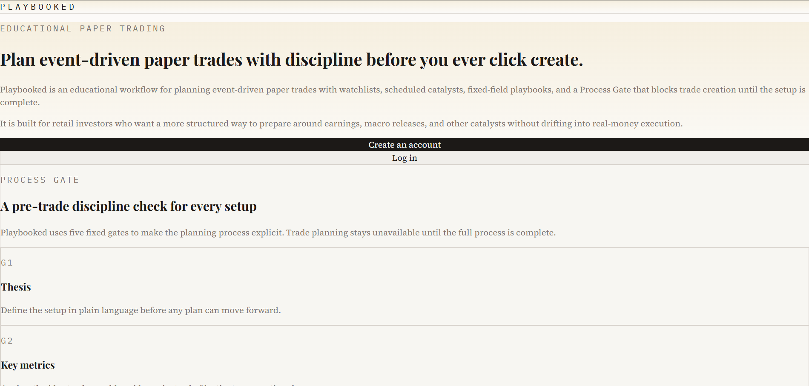
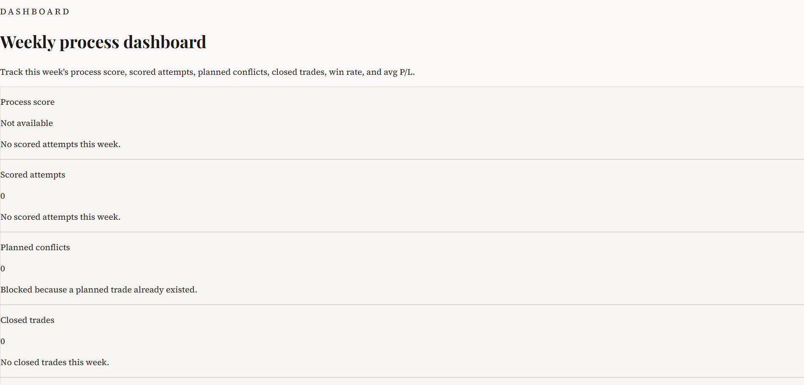
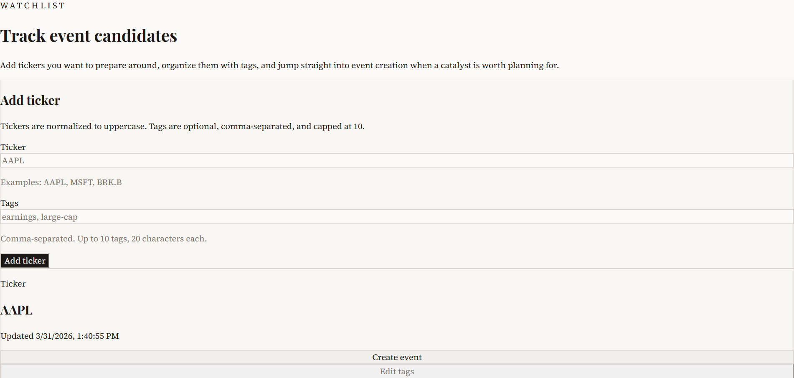
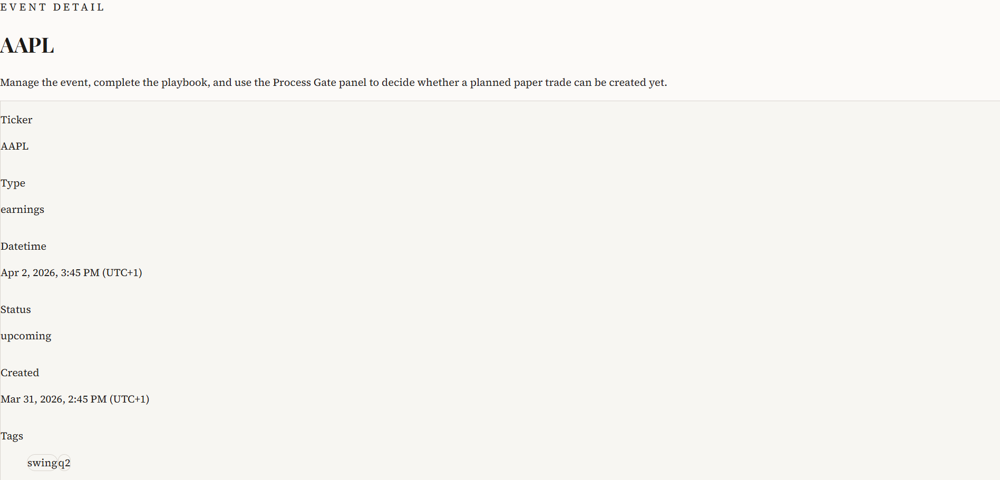
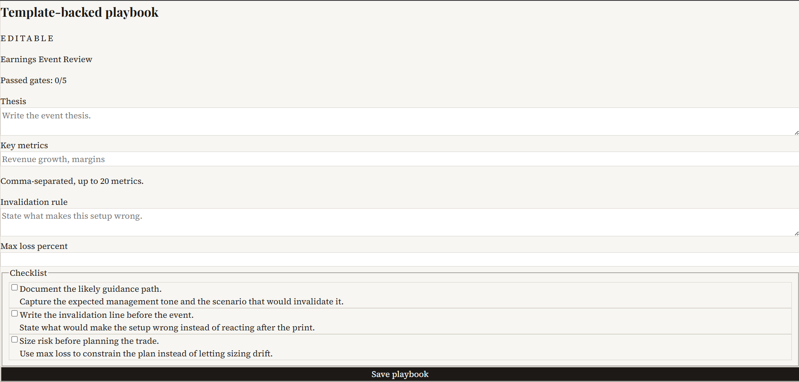
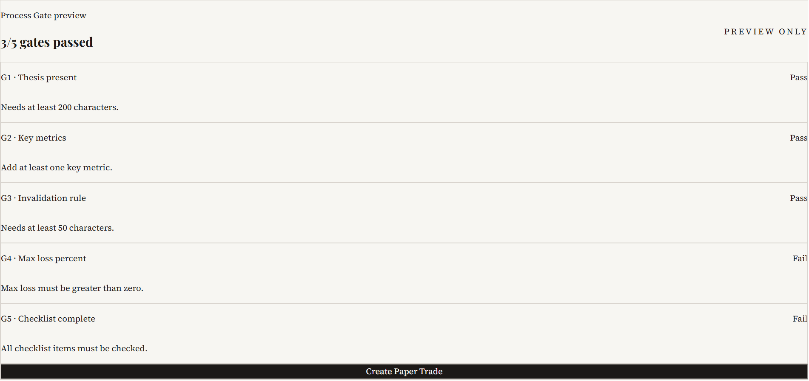
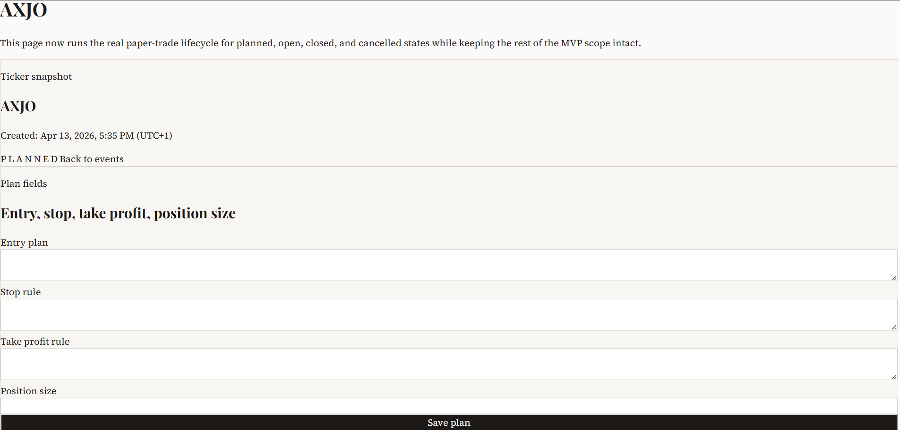
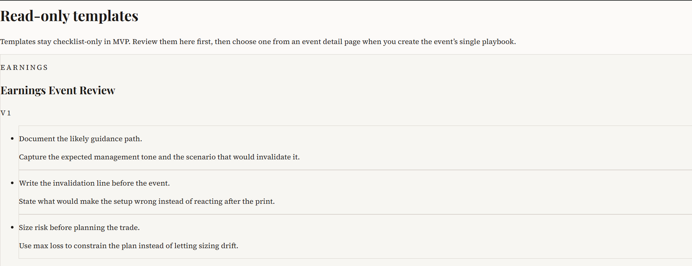
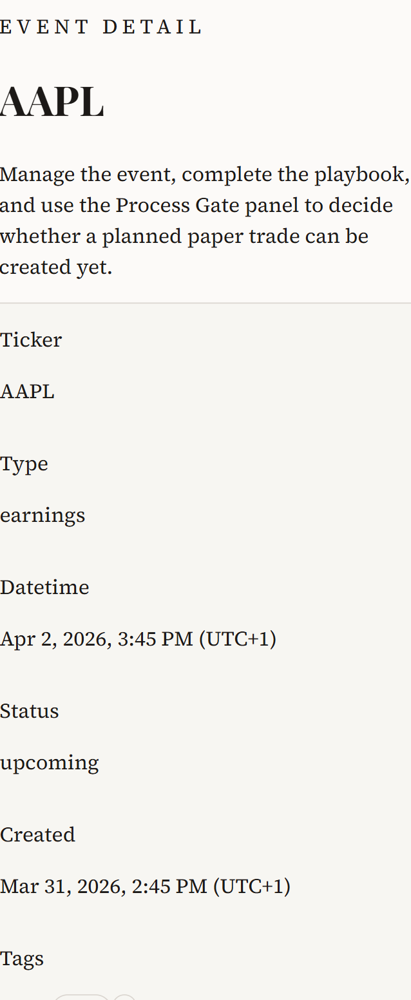

# Playbooked

Playbooked is a full-stack paper-trading workflow app built around one hard rule: a trade plan does not exist until the pre-trade Process Gate passes.

It is a deployed React + Express + Postgres project that focuses on backend rule enforcement, clear workflow states, and product decisions that hold up across the UI, API, and database. The app turns trade preparation into a structured process instead of a loose note-taking exercise.

- [Live app](https://playbooked-web.onrender.com)
- [GitHub repo](https://github.com/saramkj/playbooked)

## Project pitch

The core idea behind Playbooked is simple: if discipline matters, it should be enforced by the product.

Users build a watchlist, create an event, create exactly one playbook for that event, and then attempt to create a paper trade. If the playbook fails any of the five Process Gates, trade creation is blocked. Every attempt is still logged as a `GateAttempt`, which means the weekly dashboard reflects real behavior instead of static summaries.

This project is built to show real full-stack engineering work: product rules encoded in the backend, consistent API contracts, a relational data model with real constraints, session-based auth with CSRF protection, and a working Render deployment.

## Live app

Playbooked is live on Render and working as a deployed app.

- Frontend: [Live app](https://playbooked-web.onrender.com)
- Source: [GitHub repo](https://github.com/saramkj/playbooked)

The public API is deployed separately behind the frontend, but the README keeps the focus on the product rather than advertising raw endpoints.

## Key features

- Process Gate hard-block: a paper trade cannot be created unless all five gates pass.
- Every trade attempt logs a `GateAttempt`, including blocked attempts.
- One planned trade per playbook, enforced as a real backend and database rule.
- One playbook per event.
- Playbook locks when any linked trade transitions to `OPEN`.
- Weekly dashboard stats are based on actual attempts and closed trades.
- Templates are checklist/help only; they do not change the underlying playbook schema.
- Strict API behavior with consistent `401`, `403`, `404`, `409`, and `422` responses.
- UTC storage with local-time display in the UI.
- Cookie-session auth with double-submit CSRF protection.

## How it works

1. Add a ticker to the watchlist.
2. Create an event for that ticker.
3. Create exactly one playbook for that event from a template.
4. Fill in the fixed playbook fields: thesis, key metrics, invalidation rule, max loss, and checklist state.
5. Attempt to create a paper trade.
6. If any Process Gate fails, the trade is blocked and the failed attempt is still logged.
7. If all gates pass, the app creates a `planned` paper trade.
8. When a trade moves to `OPEN`, the linked playbook becomes read-only.
9. After the trade is closed or cancelled, the user logs the outcome and reviews the weekly dashboard.

The workflow is intentionally opinionated. Templates help structure the checklist and guidance, but they do not define dynamic playbook fields.

## Screenshots

These image references are wired in now so the README is ready for a final showcase pass.

### Desktop










### Mobile



Screenshot planning and capture notes live in [docs/showcase/shot-list.md](docs/showcase/shot-list.md).

## Architecture

Playbooked uses a straightforward full-stack TypeScript setup:

- Frontend: React, Vite, TypeScript, Tailwind CSS
- Backend: Node.js, Express, TypeScript
- Database: Postgres
- Session storage: Redis
- Deployment: Render

The important part is not just the stack list. The app’s workflow rules are enforced on the backend and backed by the data model:

- the API evaluates the Process Gate before allowing trade creation
- every attempt is recorded as a `GateAttempt`
- planned-trade conflicts are treated as explicit state conflicts
- session auth and CSRF protection are part of the real request flow

Future README diagram reference:



For the written architecture breakdown, see [docs/ARCHITECTURE-DIAGRAM.md](docs/ARCHITECTURE-DIAGRAM.md).

## Engineering decisions

The most important engineering decisions in this project came from product constraints, not from presentation concerns.

- The Process Gate is enforced on the server, not just checked in the UI.
- Every trade attempt creates a `GateAttempt`, so the dashboard is based on actual behavior.
- The one-planned-trade rule is enforced with a real database constraint, not only frontend guarding.
- Playbooks remain editable while a trade is only planned, then lock on `OPEN`.
- Templates are intentionally limited to checklist/help content so the playbook model stays stable.
- Ownership and API status codes are handled explicitly so the client does not have to guess what happened.

More detail: [docs/showcase/engineering-decisions.md](docs/showcase/engineering-decisions.md)

## Security, accessibility, and performance

### Security

- Cookie-based sessions use secure defaults in production.
- State-changing requests require double-submit CSRF validation.
- Auth routes are rate limited.
- User-owned resources are scoped strictly, with `404` used for non-owned records.
- Invalid payloads return `422`, while state conflicts continue to return `409`.

References: [SECURITY.md](SECURITY.md) and [docs/AUTH.md](docs/AUTH.md)

### Accessibility

- Semantic landmarks and skip-link support are documented in the repo.
- Route-change focus handling is part of the frontend behavior.
- Form errors are surfaced with accessible field-level messaging.

### Performance

- List endpoints use bounded server-side pagination.
- The frontend uses route-level code splitting.
- Template reads are lightweight and suitable for caching because templates are read-only for investors.

## Stack

- React 19
- TypeScript
- Vite
- Tailwind CSS
- Node.js
- Express
- Prisma
- Postgres
- Redis
- Vitest
- Render

Reference: [docs/STACK.md](docs/STACK.md)

## Local setup

### Prerequisites

- Node.js
- pnpm
- Postgres
- Redis

### Environment

Copy the sample environment file:

```bash
cp .env.example .env
```

The expected variables are documented in [.env.example](.env.example).

### Install dependencies

```bash
pnpm install
```

### Run database migrations

```bash
pnpm --filter @playbooked/api db:migrate
```

### Seed local data

```bash
pnpm --filter @playbooked/api db:seed
```

### Start the app

```bash
pnpm dev
```

Default local origins from `.env.example`:

- Web: `http://localhost:5173`
- API: `http://localhost:3000`

## Testing and quality

Run the main checks from the repo root:

```bash
pnpm test
pnpm lint
pnpm typecheck
```

The current test coverage focuses on the higher-risk backend paths, including auth, dashboard logic, gate evaluation, and paper-trade behavior. The supporting docs also define manual verification expectations for security and deployment.

- [docs/API.md](docs/API.md)
- [SECURITY.md](SECURITY.md)
- [docs/AUTH.md](docs/AUTH.md)

## Deployment

The app is deployed on Render as separate frontend and backend services, with managed Postgres and Redis.

- Infrastructure blueprint: [render.yaml](render.yaml)
- Deployment guide: [DEPLOYMENT.md](DEPLOYMENT.md)
- Live frontend: [Live app](https://playbooked-web.onrender.com)

The deployment setup is intentionally simple and production-shaped: static frontend, API service, database, and session store.

## Limitations and future improvements

- Outcomes are manually entered; there is no market data or event ingestion in the current version.
- Templates are intentionally constrained to checklist/help content rather than dynamic schemas.
- The dashboard is weekly and process-focused by design, not a broad analytics suite.
- The current product is centered on the investor workflow; coach/review flows are future work.
- The README screenshot set is structured and linked, but the final image assets can still be expanded.

## Compliance note

Playbooked is an educational paper-trading project for process discipline. It does not provide investment advice and it does not support real-money trading.
