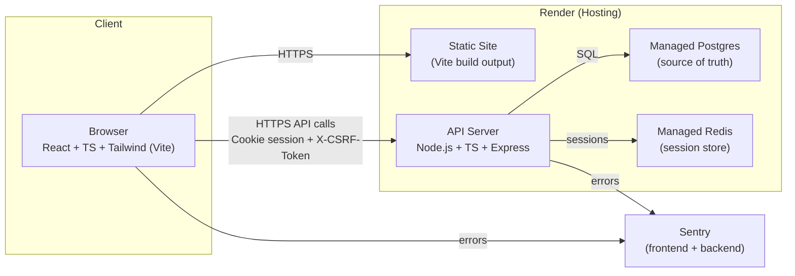

# ARCHITECTURE-DIAGRAM.md — Playbooked (MVP)

  
## Responsibilities (what happens where)
CSRF token set
API sets a csrf_token cookie (not HttpOnly) on login/session creation.

Browser reads cookie and sends X-CSRF-Token header on non-GET requests.

CSRF token validated
API middleware compares X-CSRF-Token header to csrf_token cookie.

Mismatch → 403 and UI shows: “Security check failed. Refresh and try again.”

Sessions live
Browser stores session ID in secure cookie (HttpOnly; Secure in prod; SameSite=Lax).

API stores session state in Redis so multiple API instances work.

Primary data lives
All app entities live in Postgres:

users, watchlist items, events, templates, playbooks, paper trades, gate attempts

GateAttempt logging
Every POST /api/paper-trades creates exactly one GateAttempt, regardless of outcome.

Planned-trade-exists branch logs GateAttempt with blocked_by_existing_planned_trade=true (no gate evaluation).

Process Gate hard-block
API evaluates G1–G5 server-side before creating a planned trade.

If any gate fails → 422 with gate_errors + passed_gate_count.

Concurrency-safe “one planned trade per playbook”
Enforced by Postgres partial unique index:

UNIQUE(playbook_id) WHERE status='planned'

If violated → 409 conflict_type="planned_trade_exists" and API returns the existing planned_trade_id.

Playbook locking
First time any trade transitions to OPEN, playbook becomes read-only.

Playbook edit attempts after lock → 409 conflict_type="playbook_locked".

UI mapping for locked status codes
401: redirect to login + session-expired banner

403: CSRF/forbidden banner (refresh or access denied)

404: not found screen

409: conflict banner (planned exists / locked / already exists)

422: inline field errors + form summary; gate errors shown in Gate Panel

Monitoring
Sentry captures frontend runtime exceptions and backend errors (IDs/statuses only).

Server logs are structured (pino) and redact all free-text fields (thesis, rules, notes).